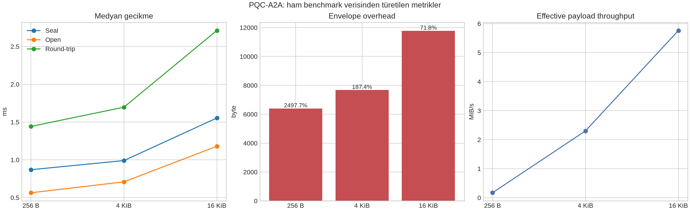
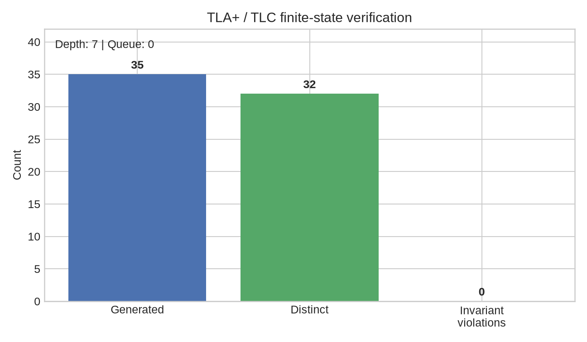

# PQC-A2A: Hibrit Post-Quantum Agent-to-Agent Kütüphanesi

Bu depo, otonom ajanlar arasındaki mesajlaşma için **araştırma amaçlı bir hibrit PQC prototipidir**. ML-KEM-768 ile X25519 birlikte kullanılır. Mesaj kimlik doğrulaması ML-DSA-65 ile yapılır. İçerik AES-256-GCM ile şifrelenir. QUIC profili TLS 1.3 ve `pqc-a2a/1` ALPN değerini kullanır. Uzun süreli manifest doğrulaması için SLH-DSA-SHA2-128s desteklenir.

> **Güvenlik sonucu:** Bu sürüm, önceki uygulamadaki doğrulama sonrası state ilerlemesi, zayıf fragment doğrulaması ve varsayılan güvensiz QUIC peer doğrulaması sorunlarını düzeltir. Şifreli identity/ratchet state, imzalı capability card ve CI doğrulaması eklenmiştir. Buna rağmen proje bağımsız bir güvenlik değerlendirmesinden geçmemiştir; üretimde kullanılmadan önce bu README’nin üretim sınırları bölümü tamamlanmalıdır.

## Doğrulama durumu

| Alan | Sonuç | Kanıt |
|---|---:|---|
| Python testleri | **17 passed** | `pytest -q` |
| PQC smoke test | **Başarılı** | ML-KEM-768 + ML-DSA-65 + AES-256-GCM |
| TLA+ invariant kontrolü | **0 ihlal** | 35 üretilen, 32 farklı durum |
| Veri analizi kontrolleri | **Başarılı** | `benchmarks/analysis_summary.json` |

Bu tablo, kaynak kodun ve mevcut sonlu modelin doğrulama durumunu özetler. **Formal doğrulama sonucu algoritmaların, liboqs’nin veya işletim sisteminin güvenliğini kanıtlamaz.**

## Uygulanan güvenlik modeli

`seal()` her mesaj için yeni bir mesaj kimliği, X25519 ephemeral anahtarı, ML-KEM ciphertext’i ve AES-GCM nonce üretir. ML-KEM paylaşılan sırrı ile X25519 sırrı uzunluk önekli birleştirme sonrasında HKDF-SHA3-256 ile anahtara dönüştürülür. Algoritma kimlikleri, gönderen, alıcı, konuşma kimliği ve mesaj kimliği hem AEAD AAD içinde hem de ML-DSA imzasının kapsamındadır.

`open_envelope()` önce envelope sürümünü, kimlik bağını ve algoritma bağını doğrular. Ardından imzayı doğrular ve AEAD çözme işlemini tamamlar. Replay cache’e mesaj ancak bu adımlar başarılı olduktan sonra eklenir. Böylece sahte veya bozuk bir mesaj geçerli mesaj kimliğini zehirleyemez.

`AsyncKEMRatchet`, alıcının önceden ürettiği tek kullanımlık ML-KEM token’larını kullanır. Gönderici ve alıcı zincir anahtarını yalnızca başarılı şifreleme veya başarılı imzalı çözme sonrasında ilerletir. Başarısız imza, KEM decapsulation veya AES-GCM doğrulaması token’ı tüketmez ve zinciri ilerletmez. Token tüketimi tek kullanımlıdır. Kayıp ve sıra dışı teslim için skipped-key store bu prototipte yoktur.

`AsyncKEMRatchet.save_state()` ve `load_state()` zincir anahtarını, kullanılan token kümesini ve bekleyen token secret’larını parola ile şifrelenmiş bir dosyada saklar. Böylece süreç yeniden başlatıldığında ratchet state’i sıfırlanmaz. State dosyası güvenilir storage üzerinde tutulmalı ve dosya parolası bir secret manager’dan sağlanmalıdır.

`AgentCard.sign()` capability card’ı issuer’ın ML-DSA anahtarıyla imzalar. `AgentCard.verify_signed()` güvenilen issuer identity’si ile imzayı ve issuer bağını doğrular. Discovery kanalının replay, iptal ve trust-store politikası yine uygulamaya aittir.

## Mimari

```text
Agent Card A  <---- capability negotiation; discovery authentication kapsam dışı ---->  Agent Card B
     |                                                                                |
     |  Receiver: one-time ML-KEM token queue                                        |
     |  Sender: one token per message                                                |
     |  ML-KEM shared secret + chain key -> HKDF-SHA3-256 message key                 |
     |  AES-256-GCM payload + ML-DSA-65 signature                                    |
     |                                                                                |
     +--------------------------- QUIC / TLS 1.3 / ALPN pqc-a2a/1 ------------------+
                             strict application fragmentation

Long-lived manifest ------------------------------------> SLH-DSA-SHA2-128s
```

## Developer quickstart

Ubuntu’da ilk kurulumdan önce liboqs derleme araçlarını kurun. Hazır ve güvenilir bir liboqs paketi kullanan dağıtımlarda bu adım paket yöneticisinin kurallarına göre değişebilir:

```bash
sudo apt-get update
sudo apt-get install -y cmake ninja-build build-essential libssl-dev
```

Kaynak depodan doğrudan kurulum:

```bash
python3 -m venv .venv
source .venv/bin/activate
python -m pip install -U pip
python -m pip install 'pqc-a2a[dev] @ git+https://github.com/dogukandemirci-software-engineer/pqc-a2a.git'
pqc-a2a doctor
```

Yerel geliştirme için:

```bash
python -m pip install -e '.[dev]'
pytest -q
python examples/quickstart.py
```

`pqc-a2a doctor`, liboqs’nin ML-KEM-768, ML-DSA-65 ve SLH-DSA mekanizmalarını açabildiğini kontrol eder. Kimlik oluşturmak için parola komutu kullanılabilir:

```bash
pqc-a2a identity-create agent-a agent-a.identity.json
```

Özel anahtarlar düz JSON olarak yazılmaz. `AgentIdentity.save()` ve `AgentIdentity.load()` scrypt ile parola türetir, ardından AES-256-GCM ile identity kaydını şifreler. Parola minimum 12 karakterdir ve identity dosyası mümkün olduğunda `0600` izinleriyle oluşturulur.

Mesajlaşmanın en kısa Python örneği:

```python
from pqc_a2a import AgentIdentity, ReplayCache, open_envelope, seal

sender = AgentIdentity("agent-a")
recipient = AgentIdentity("agent-b")
envelope = seal(sender, recipient, {"type": "task.result", "value": 42})
message = open_envelope(recipient, sender, envelope, ReplayCache())
assert message["value"] == 42
```

`examples/quickstart.py`, bu akışın şifreli identity dosyasıyla tekrar başlatılabilen sürümüdür.

## Kurulum ve test

Ubuntu üzerinde liboqs-python ilk PQC çağrısında liboqs derleyebilir. Güvenilir kurulum için aşağıdaki native bağımlılıklar gerekir:

```bash
sudo apt-get update
sudo apt-get install -y cmake ninja-build build-essential libssl-dev
python3 -m venv .venv
source .venv/bin/activate
pip install -e '.[dev]'
pytest -q
python3 benchmarks/analyze_results.py
```

Beklenen sonuç:

```text
17 passed
```

PQC kütüphanesi derlenemediğinde test toplama aşamasında hata alınır; bu durum testlerin atlanması anlamına gelmez. Üretimde liboqs sürümü, native build çıktısı ve platform matrisi sabitlenmelidir. TLA+ kontrolü ayrıca [Formal verification: TLA+](#formal-verification-tla) bölümündeki komutla çalıştırılır. Projede Python 3.10–3.12 için hazır bir CI workflow taslağı da bulunur; GitHub Actions’a yüklemek için repository token’ında `workflows` yetkisi etkin olmalıdır.

## Formal verification: TLA+

`formal/Ratchet.tla`, asenkron KEM ratchet’ın soyut state machine modelidir. Model şu özellikleri ifade eder:

- Başarısız açma denemesi token state’ini değiştirmez.
- Başarılı açma bir token’ı yalnızca bir kez tüketir.
- Alıcı zinciri gönderici zincirinin önüne geçmez.
- Tüketilmiş token’lar açılmış token kümesinde bulunur.

`formal/Ratchet.cfg`, iki token ve sonlu başarısız deneme sınırıyla sonlu bir durum uzayı tanımlar. Bu sınır, TLC’nin model-checking işlemini tekrarlanabilir kılar; gerçek uygulamanın mesaj sayısını sınırlayan bir güvenlik iddiası değildir.

TLC çalıştırmak için resmi `tla2tools.jar` dosyasını indirip ortam değişkenini ayarlayın:

```bash
mkdir -p .tools
curl -L --fail -o .tools/tla2tools.jar \
  https://github.com/tlaplus/tlaplus/releases/download/v1.7.4/tla2tools.jar
TLA2TOOLS_JAR="$PWD/.tools/tla2tools.jar" bash formal/run_tlc.sh
```

Doğrulanan çalışma, **35 durumun tamamında** hata bulmadan tamamlanmıştır. Bu model kriptografik primitiflerin güvenliğini, liboqs uygulamasını, anahtar yönetimini, sertifika zincirini veya Python bellek temizliğini kanıtlamaz. TLA+ sonucu yalnızca modellenen protocol-state invariants için geçerlidir. Sonuçlar [makine-okunabilir özet](formal/verification_summary.json) ve [grafik](formal/verification.png) olarak da saklanır.

## Transport ve fragmentation

`TransportProfile.client_configuration()` artık TLS peer doğrulamasını `ssl.CERT_REQUIRED` olarak kurar. Gerçek istemci bağlantısında güvenilir CA dosyası (`cafile`) ve uygun `server_name` verilmelidir. Sertifika doğrulamasını kapatmak için bir seçenek sunulmaz. Sunucu tarafında istemci sertifikası varsayılan olarak zorunlu değildir; karşılıklı TLS gerektiğinde `require_client_certificate=True` kullanılmalıdır.

`fragment()` her fragment’ın tamamının MTU sınırına sığmasını sağlar. `reassemble()` sürümü, JSON header’ı, parça aralığını, toplam sayıyı, duplicate index’leri, eksik parçaları ve tam SHA-256 digest’i doğrular. Header içindeki delimiter byte’ları payload’dan ayrıdır; payload içeriği framing’i bozamaz.

Bu yardımcılar tam socket lifecycle, sertifika provisioning, TCP gateway, congestion policy veya durable receive state uygulamaz. QUIC kullanımı gerçek bir bağlantının güvenli olduğu anlamına gelmez; sertifika güven zinciri ve peer identity uygulama tarafından doğru kurulmalıdır.

## Veri analizi ve matematiksel doğrulamalar

Bu bölümdeki sayılar `benchmarks/results.csv` içindeki üç gerçek benchmark satırından türetilir. Yeni bir sonuç üretmek veya eksik gözlemleri tahmin etmek yerine, analiz script’i aynı CSV’yi okuyarak bütün metrikleri yeniden hesaplar:

```bash
python3 benchmarks/analyze_results.py
```

Script `benchmarks/analysis_summary.json` ve `benchmarks/analysis.png` dosyalarını üretir. Grafik, medyan seal/open/round-trip gecikmesini, mutlak envelope overhead’ını ve etkin payload throughput’unu birlikte gösterir.



Her satır için kullanılan denklemler şöyledir. `P` payload byte sayısını, `E` envelope byte sayısını, `T` round-trip süresini, `S` seal süresini ve `O` open süresini gösterir:

```text
mutlak overhead       = E - P
overhead oranı        = (E - P) / P
envelope genişlemesi  = E / P
etkin throughput      = P / (T / 1000) / 2^20  MiB/s
medyan tutarlılık hatası = T - S - O
```

### Hesaplanan benchmark metrikleri

| Payload | Envelope | Overhead | Overhead oranı | Genişleme | Round-trip | Etkin throughput |
|---:|---:|---:|---:|---:|---:|---:|
| 256 B | 6.650 B | 6.394 B | %2.497,7 | 25,98× | 1,442 ms | 0,169 MiB/s |
| 4 KiB | 11.770 B | 7.674 B | %187,4 | 2,87× | 1,696 ms | 2,303 MiB/s |
| 16 KiB | 28.154 B | 11.770 B | %71,8 | 1,718× | 2,711 ms | 5,763 MiB/s |

Bu sonuç iki önemli mühendislik etkisini gösterir. Birincisi, sabit boyutlu PQC public-key/ciphertext ve imza alanları küçük payload’larda baskın olduğundan 256 B mesajın envelope’u payload’ın yaklaşık 26 katıdır. İkincisi, payload büyüdükçe sabit kriptografik overhead amorti olur; bu nedenle mutlak overhead 6.394 B’den 11.770 B’ye çıkmasına rağmen overhead oranı %2.497,7’den %71,8’e iner.

### Veri tutarlılığı kontrolleri

Analiz script’i aşağıdaki sonlu veri kontrollerini de yapar:

| Kontrol | Sonuç |
|---|---:|
| Gözlem satırı sayısı | 3 |
| Tüm round-trip süreleri pozitif | `true` |
| Payload boyutları monoton artıyor | `true` |
| Round-trip süreleri monoton artıyor | `true` |
| Envelope boyutları monoton artıyor | `true` |
| Tüm overhead değerleri pozitif | `true` |
| `|T - S - O|` maksimumu | 0,020787 ms |

Son satır için önemli bir metodolojik sınır vardır: benchmark, `T` değerini her örnekte `S + O` olarak ölçse de medyanlar bağımsız olarak alındığı için genel olarak `median(S + O) = median(S) + median(O)` eşitliği beklenmez. Bu nedenle 0,020787 ms fark bir kriptografik doğrulama değil, ölçüm tutarlılığı göstergesidir.

### TLA+ durum uzayı verisi

TLA+ doğrulaması `formal/verification_summary.json` içinde makinece okunabilir biçimde saklanır. TLC 2.19, `Ratchet.cfg` ile sonlu modelin 35 durumunu üretmiş, 32 farklı durumu ziyaret etmiş ve kuyruğu sıfıra indirmiştir. Beş değişmezden hiçbirinde ihlal bulunmamıştır.



| Formal metrik | Değer |
|---|---:|
| Üretilen durum | 35 |
| Farklı durum | 32 |
| Durum deduplikasyon oranı, `32 / 35` | %91,43 |
| Tamamlanan grafik derinliği | 7 |
| Arama kuyruğunda kalan durum | 0 |
| Kontrol edilen değişmez | 5 |
| Değişmez ihlali | 0 |

Buradaki `0 / 5 = %0` ihlal oranı, yalnızca sonlu modeldeki beş mantıksal özelliğin ihlal edilmediğini gösterir. Bu sonuç ML-KEM, ML-DSA, AES-GCM veya liboqs implementasyonlarının matematiksel güvenliğini kanıtlamaz. Aynı şekilde `32 / 35` oranı bir güvenlik olasılığı değildir; TLC’nin ürettiği durumların ne kadarının birbirinden farklı olduğunu gösteren bir raporlama metriğidir. Formal iddia, aşağıdaki değişmezlerle sınırlıdır:

```text
TypeOK              : bütün değişkenler tanımlı sonlu tiplerde
NoConsumeOnBad     : başarısız açma token state’ini değiştirmez
SingleUse           : açılmış token sayısı başarılı açma sayısına eşittir
ReceiverNeverAhead  : receiver_chain <= sender_chain
TokenConsistency   : consumed token, opened kümesinde bulunur
```

Dolayısıyla benchmark bölümü **ölçümsel kanıt**, TLA+ bölümü ise modellenen state machine için **durum-uzayı kanıtı** sunar. İki sonuç da bağımsız güvenlik denetiminin veya kriptografik ispatın yerine geçmez.

## Test kapsamı

Test paketi şu davranışları kapsar:

- Hibrit envelope round-trip, replay rejection, ciphertext tampering ve identity binding.
- ML-KEM ratchet token tüketimi, zincir ilerlemesi, replay ve başarısız çözmede state rollback.
- Archive signer imzası, algoritma alanı ve manifest digest doğrulaması.
- MTU sınırı, delimiter byte’ları, sıra dışı fragment teslimi, duplicate ve out-of-range rejection.
- TLS client peer verification ayarı.
- Agent Card negotiation ve QUIC ALPN ayarı.
- Şifreli identity persistence, yanlış parola reddi ve public/private key eşleşmesi.
- İmzalı capability card doğrulaması ve tamper reddi.
- Şifreli ratchet state persistence ve süreç yeniden başlatma sonrası mesajlaşma.

## Üretim sınırı ve kalan entegrasyonlar

Kütüphane doğrudan kurulabilir ve test edilebilir bir referans uygulamadır. Aşağıdaki maddeler kütüphane içindeki temel mesajlaşma akışını engellemez; gerçek bir üretim dağıtımında ayrıca yapılandırılması gereken entegrasyon sınırlarıdır:

1. Agent Card ve public key discovery için imzalı, replay-korumalı ve sertifika doğrulamalı bir kanal.
2. Kimlik iptali, anahtar rotasyonu, güvenli kalıcı ratchet state ve çoklu süreç eşzamanlama politikası.
3. Kayıp ve out-of-order mesajlar için bounded skipped-key store ve denial-of-service limitleri.
4. KMS veya HSM entegrasyonu, secret material yaşam döngüsü ve Python bellek temizleme sınırları.
5. QUIC sertifika provisioning, hostname/SAN doğrulaması, mutual TLS kararı ve TCP fallback’in gerçek uygulaması.
6. Fuzzing, property-based testing, bağımsız kriptografik protokol incelemesi ve tehdit modelinin operasyonel doğrulaması.

PQC algoritmalarının standardizasyon statüsü ve mekanizma adları liboqs sürümüne bağlıdır. `liboqs-python` ve liboqs sürümü yükseltilmeden önce mekanizma adları, test sonuçları ve benchmark’lar yeniden doğrulanmalıdır.

## Kaynaklar

[1]: https://csrc.nist.gov/pubs/fips/203/final "FIPS 203: Module-Lattice-Based Key-Encapsulation Mechanism Standard"
[2]: https://csrc.nist.gov/pubs/fips/204/final "FIPS 204: Module-Lattice-Based Digital Signature Standard"
[3]: https://github.com/open-quantum-safe/liboqs-python "liboqs-python bindings"
[4]: https://github.com/open-quantum-safe/liboqs "Open Quantum Safe liboqs"
[5]: https://github.com/aiortc/aioquic "aioquic QUIC and HTTP/3 implementation"
[6]: https://lamport.azurewebsites.net/tla/tla.html "The TLA+ Specification Language and Tools"
