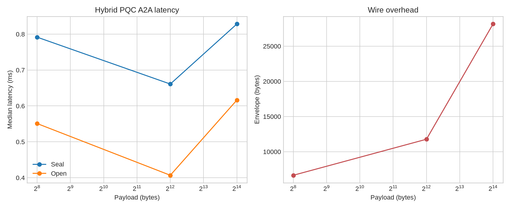

# PQC-A2A: Post-Quantum Secure Agent-to-Agent PoC

Bu depo, Zenodo kaydında sunulan **Post-Quantum Cryptography Integration Framework for Autonomous Agent-to-Agent (A2A) Systems: Architecture, Threats, and Optimization Strategies** çalışmasının uygulanabilir bir araştırma prototipidir. Makalenin erişilebilir kaydı kavramsal bir entegrasyon çerçevesi sunduğu için replica, çerçevedeki katmanları çalışan bir mesajlaşma akışına indirger: yetenek pazarlığına uygun algoritma adları, hibrit anahtar kurma, kimlik doğrulama, gizlilik, bütünlük, replay savunması ve ölçülebilir performans.

> **Sonuç:** PoC, ML-KEM-768 ile X25519 paylaşılan sırlarını birlikte kullanan bir anahtar birleştirici, ML-DSA-65 imzası ve AES-256-GCM veri şifrelemesiyle uçtan uca A2A mesajı taşır. Benchmark sayıları sentetik değildir; `benchmarks/benchmark.py` çalıştırılarak bu kodun gerçek CPU ölçümlerinden üretilir.



## Mimari

```text
Agent A                                                        Agent B
  |-- ML-DSA-65 identity ------------------------------------------->|
  |<-------------------------- ML-KEM-768 public key + X25519 key --|
  |                                                                 |
  |  ephemeral X25519 + ML-KEM encapsulation                        |
  |  HKDF-SHA3-256(pqc_secret || classical_secret)                  |
  |  AES-256-GCM(payload, canonical AAD)                            |
  |-- signed envelope: nonce, ciphertext, KEM ciphertext, AAD ------>|
  |                                                                 |
  |<-- signature verify, replay check, KEM decapsulation, decrypt ---|
```

Her envelope kimlikleri, konuşma kimliğini, mesaj kimliğini ve seçilen algoritmaları imzalı ek veriye bağlar. Böylece bir mesaj başka bir ajana yönlendirilemez. Replay cache aynı `message_id` değerini TTL süresince ikinci kez kabul etmez. AES-GCM yalnızca mesaj gövdesini taşır; anahtar materyali envelope içine yazılmaz.

## Hızlı başlangıç

```bash
python3 -m venv .venv
source .venv/bin/activate
pip install -e .
pytest -q
python benchmarks/benchmark.py 20
```

`liboqs-python` ilk kullanımda `liboqs` kütüphanesini yerel olarak derleyebilir. Ubuntu için `cmake`, `ninja-build`, `build-essential`, `libssl-dev` gereklidir. Üretimde derleme yerine güvenilir, sabitlenmiş bir liboqs paketi ve donanım/işletim sistemi matrisi kullanılmalıdır.

## Benchmark

Benchmark üç gerçek payload boyutunda 20 round-trip örneği alır. Her örnekte yeni ajan kimlikleri bir kez oluşturulur; her mesaj için yeni ephemeral X25519 anahtarı, KEM ciphertext'i ve AES-GCM nonce üretilir. `results.csv` medyan `seal`, `open`, toplam round-trip gecikmesini ve envelope boyutunu kaydeder. Grafik, payload büyüklüğünün kriptografik sabit maliyet ve wire overhead üzerindeki etkisini gösterir.

| Ölçüm | Tanım |
|---|---|
| Seal latency | KEM encapsulation + X25519 + HKDF + AES-GCM + ML-DSA-65 imzası |
| Open latency | ML-DSA-65 doğrulama + replay kontrolü + KEM decapsulation + AES-GCM açma |
| Envelope size | JSON envelope'un UTF-8 byte uzunluğu |
| Round-trip | Seal ve open medyanlarının aynı örnek üzerindeki toplamı |

## Test kapsamı

`tests/test_protocol.py` başarılı mesaj round-trip'ini, tekrar oynatma reddini, ciphertext değişikliğinin reddini ve recipient kimlik bağlamasının korunmasını kontrol eder. Bu testler protokolün temel güvenlik özelliklerini doğrular; resmi güvenlik ispatı, yan kanal analizi, dağıtık PKI, sertifika iptali ve A2A üretim transportu kapsam dışıdır.

## Paper-to-PoC eşlemesi

| Çerçeve fikri | Replica karşılığı |
|---|---|
| Crypto agility | Envelope içinde `kem`/`sig` alanları; kimlik sınıfında seçilebilir mekanizma adları |
| Quantum-safe key establishment | NIST standardize ML-KEM-768 |
| Agent authentication | NIST standardize ML-DSA-65 |
| Classical fallback resistance | X25519 ve ML-KEM sırlarının HKDF ile birlikte zorunlu kullanımı |
| Confidentiality/integrity | AES-256-GCM ve imzalı canonical AAD |
| Session/message freshness | Conversation ID, random message ID ve TTL replay cache |
| Optimization measurement | Payload boyutlarına göre benchmark ve PNG grafik |

## Sınırlamalar ve güvenlik notu

Bu proje bir **PoC ve paper replica**dır. A2A servis discovery, HTTPS/mTLS, sertifika otoritesi, anahtar rotasyonu, donanım güvenlik modülü ve üretim gözlemlenebilirliği eklenmeden gerçek ajan trafiğine açılmamalıdır. ML-KEM ve ML-DSA parametreleri standardize mekanizmalardır; ancak liboqs sürümü, platform ve derleme seçenekleri benchmark sonuçlarını değiştirir. Sonuçları karşılaştırırken Python sürümü, CPU modeli, liboqs commit'i ve örnek sayısını kaydedin.

## Kaynaklar

[1]: https://zenodo.org/records/22898956 "Post-Quantum Cryptography Integration Framework for Autonomous Agent-to-Agent (A2A) Systems: Architecture, Threats, and Optimization Strategies"
[2]: https://github.com/open-quantum-safe/liboqs-python "liboqs-python bindings"
[3]: https://github.com/open-quantum-safe/liboqs "Open Quantum Safe liboqs"
[4]: https://csrc.nist.gov/pubs/fips/203/final "FIPS 203: Module-Lattice-Based Key-Encapsulation Mechanism Standard"
[5]: https://csrc.nist.gov/pubs/fips/204/final "FIPS 204: Module-Lattice-Based Digital Signature Standard"

## Gerçek çalıştırma özeti

Ubuntu 24.04 üzerinde, 20 örnek ve `liboqs-python 0.16.0` ile alınan medyan sonuçlar şöyledir:

| Payload | Seal (ms) | Open (ms) | Round-trip (ms) | Envelope (bytes) |
|---:|---:|---:|---:|---:|
| 256 B | 0.792 | 0.551 | 1.350 | 6,650 |
| 4 KiB | 0.661 | 0.407 | 1.085 | 11,770 |
| 16 KiB | 0.828 | 0.616 | 1.435 | 28,154 |

Bu değerler karşılaştırmalı bir donanım iddiası değildir. Native liboqs derlemesi, CPU özellikleri ve Python sürümü sonucu etkiler; yeniden üretilebilir ham çıktı `benchmarks/results.csv` içindedir.
