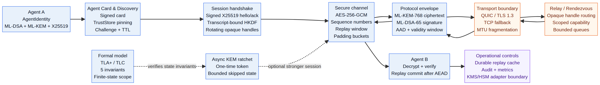
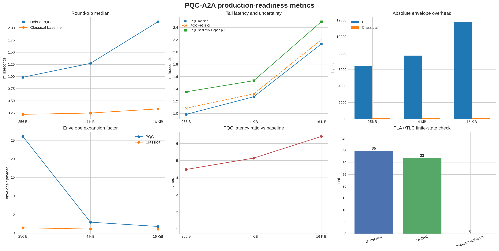

# PQC-A2A

**PQC-A2A**, AI ajanları arasında kimlik doğrulamalı ve hibrit post-quantum güvenlikli mesajlaşma için Python kütüphanesidir. Proje; **ML-KEM-768 + X25519** ile anahtar anlaşması, **ML-DSA-65** ile imza, **AES-256-GCM** ile veri gizliliği ve replay/state kontrolleri etrafında yapılandırılmıştır.

> **Durum:** Güvenlik hardening ve regression testleri uygulanmış production adayı bir temel. PKI/CA, KMS/HSM, dağıtık replay storage, sertifika rotasyonu ve bağımsız kriptografik protokol incelemesi hâlâ deployment sorumluluğudur. Bu proje formal güvenlik ispatı veya anonimlik çözümü iddiasında değildir.

[English README](README.en.md) · [Threat model](docs/THREAT_MODEL.md) · [Secure architecture](docs/SECURE_AGENT_ARCHITECTURE.md) · [Protocol architecture source](docs/protocol_architecture.mmd)

## Öne çıkan özellikler

| Katman | Sağlanan kontrol |
| --- | --- |
| Hibrit anahtar anlaşması | ML-KEM-768 ile X25519 ortak secret’ının transcript-bound HKDF ile türetilmesi |
| Mesaj kimlik doğrulaması | ML-DSA-65 imzası, canonical JSON ve algorithm binding |
| Veri gizliliği | AES-256-GCM; metadata AAD içinde doğrulanır |
| Mesaj yaşam döngüsü | `issued_at`, `expires_at`, clock-skew politikası ve replay cache |
| Session kanalı | İmzalı X25519 hello/ack, opaque handle, sequence ve bounded replay window |
| Ratchet | One-time ephemeral KEM token’ları, bounded queue, state persistence ve başarısız decrypt sonrası state koruması |
| Kimlik ve güven | Signed Agent Card, discovery challenge/TTL, trust-store pinning ve key rotation yapı taşları |
| Transport | QUIC/TLS 1.3 profili, TLS TCP fallback ve MTU-aware fragmentation |
| Relay | Opaque handle routing, scoped capability token, TTL-bound rendezvous ve bounded queue |
| Operasyon | Durable SQLite replay cache, audit event hook, metrics hook, skipped-key limitleri |
| A2A uyumluluğu | Transport-neutral Agent Card ve JSON-RPC 2.0 request/result yardımcıları |

## Protokol mimarisi

Aşağıdaki şema discovery’den session handshake’e, şifreli envelope’dan transport/relay katmanına kadar ana veri akışını gösterir. Kesikli oklar ratchet ve formal modelin secure channel ile ilişkisini gösterir.



Şemanın kaynak dosyası [`docs/protocol_architecture.mmd`](docs/protocol_architecture.mmd) içindedir.

### Mesaj akışı

1. **Identity ve Agent Card:** Ajan ML-KEM, ML-DSA ve X25519 public material’ı üretir. Agent Card signing identity ile imzalanır.
2. **Trust ve discovery:** Discovery kaydı challenge, geçerlilik aralığı ve imza ile doğrulanır. Trust store deployment tarafından sabitlenen anchor/pin politikasını taşır.
3. **Session handshake:** Taraflar kısa ömürlü X25519 anahtarlarıyla signed hello/ack değiştirir. Session key handshake transcript’ine bağlanır.
4. **Secure record:** Payload AES-256-GCM ile korunur. `session_id`, recipient handle, sequence ve padding bucket AAD olarak bağlanır.
5. **Protocol envelope:** Tekil mesajlarda ML-KEM ciphertext, ephemeral X25519 public key, nonce, ciphertext ve ML-DSA signature birlikte taşınır.
6. **Transport ve relay:** QUIC veya TLS 1.3 TCP fallback kullanılabilir. Relay yalnızca opaque handle ve secure record görmelidir.
7. **Receiver commit:** Receiver signature ve AEAD doğrulamasını tamamlamadan replay window state’ini ilerletmez.

## Kurulum

Python 3.10 veya üzeri ve native `liboqs` build ortamı gerekir. Ubuntu için:

```bash
sudo apt-get update
sudo apt-get install -y --no-install-recommends cmake ninja-build libssl-dev
python -m venv .venv
. .venv/bin/activate
python -m pip install --upgrade pip
python -m pip install -e '.[dev]'
```

Native backend’i doğrulayın:

```bash
python -c "from pqc_a2a import available_algorithms; print(available_algorithms())"
```

Beklenen katalogda en az `ML-KEM-768` ve `ML-DSA-65` bulunmalıdır. `liboqs-python`, Python wrapper’a ek olarak native shared library gerektirir; yalnızca `pip install` ile tamamlanan ortamlarda testler başlamayabilir.

## Hızlı başlangıç

```python
from pqc_a2a import AgentIdentity, ReplayCache, open_envelope, seal

sender = AgentIdentity("agent-a")
receiver = AgentIdentity("agent-b")
replay = ReplayCache(ttl_seconds=300)

envelope = seal(
    sender,
    receiver,
    {"method": "summarize", "input": "post-quantum message"},
    ttl_seconds=300,
)

payload = open_envelope(receiver, sender, envelope, replay=replay)
assert payload["method"] == "summarize"
```

Identity ve ratchet state dosyaları scrypt + AES-GCM ile password-protected saklanabilir:

```python
identity.save("agent.identity.json", password="a-long-development-password")
restored = AgentIdentity.load("agent.identity.json", password="a-long-development-password")
```

Bu dosya tabanlı şifreleme KMS/HSM yerine geçmez. Production deployment’ta password’lerin kaynak kodda veya düz environment variable içinde tutulmaması gerekir.

## Production güvenlik modeli

| Korunan varlık | Kütüphane kontrolü | Deployment sorumluluğu |
| --- | --- | --- |
| Mesaj gizliliği | ML-KEM/X25519 hybrid derivation + AES-GCM | Anahtarların KMS/HSM’de tutulması ve rotation |
| Mesaj bütünlüğü | ML-DSA signature + AES-GCM authentication tag | Trusted identity/public-key dağıtımı |
| Replay | In-memory veya durable replay backend | HA storage, backup/restore ve retention |
| Session replay | Bounded replay window; authentication sonrası commit | Session persistence ve failover politikası |
| Agent Card sahteciliği | Signed card + trust-store pinning | Root anchor, revocation ve monitoring |
| Transport peer | TLS 1.3, CA verification, opsiyonel mTLS | CA issuance, renewal, SAN/EKU ve network policy |
| Metadata | Opaque handle ve padding bucket yardımcıları | Relay/VPN/mixnet topolojisi ve traffic shaping |
| Secret storage | Password-protected identity/ratchet formats | KMS/HSM, access control, memory/process isolation |

> **Önemli sınır:** Şifreleme tek başına IP adresini, timing’i, bağlantı süresini veya trafik hacmini gizlemez. Global passive observer’a karşı anonymity, unlinkability veya güçlü traffic-analysis resistance iddiası yoktur.

## Hardening durumu

Son hardening commit’inde (`fcb6c17`) aşağıdaki production riskleri kapatıldı veya sınırlandırıldı:

- Failed secure-channel ciphertext’inin replay window’u ilerletmesi engellendi.
- `DurableReplayCache(":memory:")` bağlantılar arasında state kaybetmeyecek şekilde düzeltildi.
- Rendezvous registration, capability token subject handle’ına bağlandı.
- Capability expiry ve scope tip kontrolleri sıkılaştırıldı.
- Fragment reassembly için fragment count, total byte, message-id ve digest format limitleri eklendi.
- Dosya secret provider’ın plaintext-at-rest semantiği açık hale getirildi; atomic write ve `fsync` eklendi.
- Replay, capability ownership ve forged-high-sequence senaryoları için regression testleri eklendi.

Bu hardening bağımsız bir kriptografik incelemenin yerini tutmaz.

## Benchmark ve ölçümler

Sonuçlar repository içindeki `benchmarks/results.csv` ve `benchmarks/analysis_summary.json` dosyalarından üretilmiştir. Her veri noktası **20 örneğe** dayanır. Sonuçlar belirli bir ortamın ölçümüdür; donanım sıralaması veya genel throughput garantisi değildir.



### Temel ölçümler

| Payload | PQC envelope | Klasik envelope | PQC round-trip median | PQC seal p95 | PQC open p95 | Klasik round-trip median | PQC/klasik latency |
| ---: | ---: | ---: | ---: | ---: | ---: | ---: | ---: |
| 256 B | 6,674 B | 348 B | 0.985 ms | 0.835 ms | 0.517 ms | 0.220 ms | 4.48× |
| 4 KiB | 11,794 B | 4,188 B | 1.272 ms | 0.939 ms | 0.594 ms | 0.247 ms | 5.15× |
| 16 KiB | 28,178 B | 16,476 B | 2.131 ms | 1.461 ms | 1.033 ms | 0.332 ms | 6.41× |

| Payload | PQC absolute overhead | Klasik absolute overhead | PQC expansion | Klasik expansion | PQC round-trip CI95 |
| ---: | ---: | ---: | ---: | ---: | ---: |
| 256 B | 6,418 B | 92 B | 26.07× | 1.36× | ±0.101 ms |
| 4 KiB | 7,698 B | 92 B | 2.88× | 1.02× | ±0.047 ms |
| 16 KiB | 11,794 B | 92 B | 1.72× | 1.01× | ±0.069 ms |

### Ölçümlerin yorumu

PQC envelope boyutu özellikle küçük payload’larda sabit kriptografik metadata nedeniyle büyüktür. 256 B payload için envelope expansion factor **26.07×**, 4 KiB için **2.88×**, 16 KiB için **1.72×** ölçülmüştür. Klasik baseline expansion factor aynı sırayla **1.36×**, **1.02×** ve **1.01×** seviyesindedir.

Hybrid PQC round-trip median değeri payload büyüdükçe **0.985 ms’den 2.131 ms’ye** çıkmıştır. Bu ölçüm, ML-KEM/ML-DSA implementation’ının ve serialization maliyetinin küçük mesajlarda baskın olabileceğini gösterir. Production kapasite planı için hedef CPU mimarisinde yeni benchmark alınmalıdır.

95% confidence interval half-width değerleri PQC için sırasıyla **0.101 ms**, **0.047 ms** ve **0.069 ms**; klasik baseline için **0.020 ms**, **0.007 ms** ve **0.015 ms** olarak raporlanmıştır. Bu aralıklar ölçüm belirsizliğini gösterir; protokolün güvenlik olasılığı değildir.

Benchmark’ı yeniden üretmek için:

```bash
python benchmarks/benchmark.py 50
python benchmarks/analyze_results.py
python benchmarks/generate_readme_assets.py
```

`benchmarks/benchmark.png` temel seal/open latency ve wire overhead’i, `benchmarks/analysis.png` baseline karşılaştırmasını, `benchmarks/readme_metrics.png` ise genişletilmiş dashboard’u gösterir.

## Formal model kapsamı

Ratchet state machine’i `formal/Ratchet.tla` ve `formal/Ratchet.cfg` ile TLC 2.19 üzerinde finite-state olarak kontrol edilmiştir.

| TLC metriği | Değer |
| --- | ---: |
| Üretilen state | 35 |
| Distinct state | 32 |
| Queue’da kalan state | 0 |
| Complete graph depth | 7 |
| Invariant violation | 0 |
| Kontrol edilen invariant | 5 |

Kontrol edilen invariant’lar: `TypeOK`, `NoConsumeOnBad`, `SingleUse`, `ReceiverNeverAhead` ve `TokenConsistency`.


Bu sonuç yalnızca belirtilen finite-state model için geçerlidir. ML-KEM, ML-DSA, AES-GCM, liboqs veya Python runtime’ın matematiksel güvenliğini kanıtlamaz. `0 invariant violations` gerçek dünyada sıfır güvenlik açığı anlamına gelmez.

## Test ve kalite kontrolleri

Yerel validation sonucunda:

```text
39 passed
Ruff F/E9 source checks: passed
Bandit source scan: passed
pip-audit: no known vulnerabilities
compileall: passed
git diff --check: passed
```

Test suite envelope, replay, ratchet, signed Agent Card, discovery, trust-store, TLS/TCP framing, fragmentation, session handshake, opaque relay, capability ve operational hardening senaryolarını kapsar.

## Dizin yapısı

```text
src/pqc_a2a/
├── protocol.py          # Identity, envelopes, trust, replay, ratchet
├── secure_channel.py    # Session hello/ack, secure records, replay window
├── transport.py         # QUIC/TLS, TCP fallback, fragmentation
├── discovery.py         # Signed discovery records
├── relay.py             # Capabilities, rendezvous, opaque relay
├── operations.py        # Persistence, audit, metrics, limits
├── a2a.py               # Agent Card ve JSON-RPC adapter
└── langgraph_adapter.py # Optional LangGraph-compatible transport

tests/                   # Protocol, fuzz-like ve regression testleri
benchmarks/              # Benchmark, analysis ve README dashboard scriptleri
formal/                  # TLA+ model, TLC config ve verification output
docs/                    # Threat model, architecture ve diagram source
```

## Release öncesi checklist

- KMS/HSM-backed secret provider ve key rotation runbook’u.
- Gerçek CA/SPIFFE/SPIRE trust plane, certificate renewal ve revocation.
- Durable replay DB backup/restore, crash recovery ve multi-process testleri.
- Rate limiting, connection timeout, queue backpressure ve telemetry.
- Adversarial fuzzing; özellikle handshake replay, fragment memory pressure ve malformed schema input’ları.
- Hedef CPU/OS/Python matrisi üzerinde native liboqs build ve benchmark.
- Bağımsız cryptographic protocol review ve security disclosure süreci.

## Lisans ve referanslar

Proje MIT License ile yayımlanır. Citation metadata [`CITATION.cff`](CITATION.cff) içindedir.

[1]: https://csrc.nist.gov/pubs/fips/203/final "NIST FIPS 203: Module-Lattice-Based Key-Encapsulation Mechanism Standard"
[2]: https://csrc.nist.gov/pubs/fips/204/final "NIST FIPS 204: Module-Lattice-Based Digital Signature Standard"
[3]: https://cryptography.io/en/latest/hazmat/primitives/aead/ "cryptography AEAD primitives"
[4]: https://github.com/open-quantum-safe/liboqs "Open Quantum Safe liboqs"
[5]: https://github.com/aiortc/aioquic "aioquic QUIC and HTTP/3 implementation"
[6]: https://lamport.azurewebsites.net/tla/tla.html "The TLA+ Specification Language and Tools"
